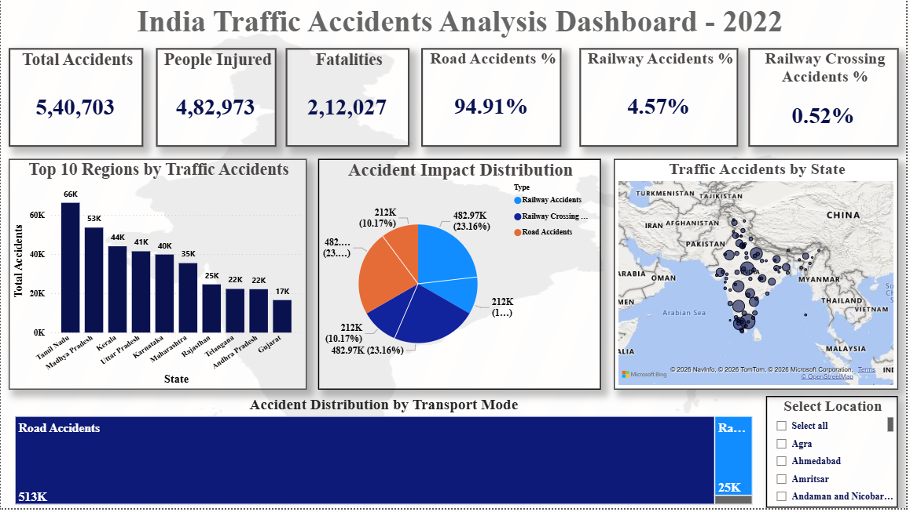

# India-Traffic-Accidents-PowerBI-Dashboard
Interactive Power BI dashboard analyzing India traffic accidents (2022) using DAX measures, KPI cards, maps, and visualizations to identify accident trends and transport mode distribution.

## Tools Used
- Power BI
- DAX
- Data Visualization

## Key Insights
- Total accidents: 540K+
- Road accidents account for ~95% of accidents
- Some regions show significantly higher accident rates

## Dashboard Preview

